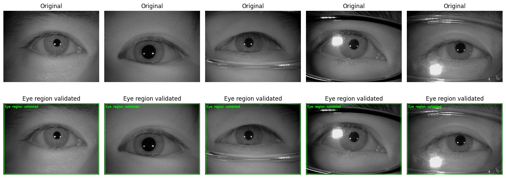
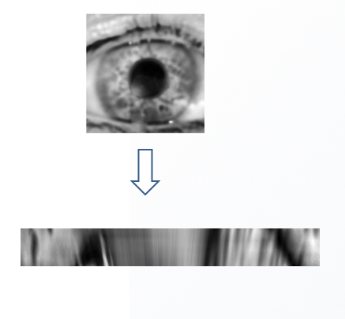

# Iris Recognition System — CASIA Dataset

> **End-to-end biometric iris recognition pipeline** — from raw eye images to identity classification using the CASIA-Iris dataset and a fine-tuned ResNet50.

---

## Overview
This project implements a complete **iris recognition system** built on the CASIA Iris Dataset. The system identifies individuals by analysing the unique texture patterns of the human iris — a biometric trait that remains stable throughout a person's lifetime and is unique even between identical twins.

The pipeline covers every stage: eye validation → iris & pupil detection → rubber-sheet normalisation → deep-learning classification across **250 identities**.

---

## Dataset

**Download:** [CASIA Iris Dataset on Kaggle](https://www.kaggle.com/datasets/YOUR-USERNAME/casia-iris-dataset)


The pipeline covers every stage: eye validation → iris & pupil detection → rubber-sheet normalisation → deep-learning classification across **250 identities**.

---

## Pipeline
```
Raw Eye Image
      │
      ▼
┌─────────────┐
│  Eye        │  Validate image dimensions & convert to grayscale
│  Detection  │
└──────┬──────┘
       ▼
┌─────────────┐
│  Iris &     │  Hybrid: Hough Circles + Integro-Differential (Daugman)
│  Pupil      │  → detect pupil boundary (inner circle)
│  Detection& │  → detect iris boundary (outer circle)
│ Segmentation│
└──────┬──────┘
       ▼
┌─────────────┐
│  Iris       │  Rubber-Sheet Model (GPU-accelerated via PyTorch)
│  Normal-    │  Unwrap annular iris region → fixed 64×512 rectangle
│  isation    │  + CLAHE contrast enhancement
└──────┬──────┘
       ▼
┌─────────────┐
│  Classifica-│  ResNet50 (ImageNet pre-trained)
│  tion       │  Phase 1: frozen backbone → train head
│             │  Phase 2: fine-tune last 40 layers
└──────┬──────┘
       ▼
  Identity Prediction  (Top-1 / Top-5)
```

---

## Examples

### Eye Detection


### Iris Segmentation


### Iris Normalization


---

## Dataset
| Property | Value |
|---|---|
| Name | CASIA Iris Dataset |
| Total images | 20 000 |
| Subjects | 2 categories (Left / Right) |
| Format | PNG / JPG, near-infrared (NIR) |
| Classes used for training | 250 (top-N by sample count) |
| Train / Val split | 80 % / 20 % (stratified) |

The dataset images are **pre-cropped** to the eye region, so no face detection step is needed.

---


## Technologies
| Tool | Role |
|---|---|
| **OpenCV** | Image I/O, Hough Circles, filtering, CLAHE |
| **NumPy** | Array math, gradient computation |
| **PyTorch** | GPU-accelerated iris normalisation (`grid_sample`) |
| **TensorFlow / Keras** | ResNet50 model, training, evaluation |
| **scikit-learn** | Train/val split, classification report |
| **Matplotlib / Seaborn** | Visualisation & plotting |
| **tqdm** | Progress bars |

---
